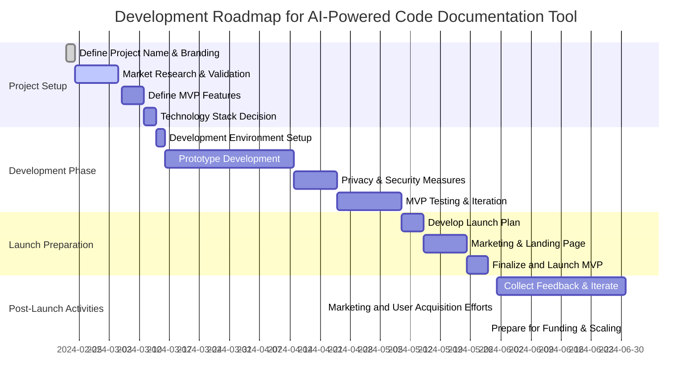

# Commit Chronicles Roadmap + Diagrams

## Gantt Chart

```mermaid
gantt
    dateFormat  YYYY-MM-DD
    title Development Roadmap for AI-Powered Code Documentation Tool

    section Project Setup
    Define Project Name & Branding            :done, 2024-02-22, 2d
    Market Research & Validation              :active, 2024-02-24, 10d
    Define MVP Features                       :2024-03-06, 5d
    Technology Stack Decision                 :2024-03-11, 3d

    section Development Phase
    Development Environment Setup             :2024-03-14, 2d
    Prototype Development                     :2024-03-16, 30d
    Privacy & Security Measures               :2024-04-15, 10d
    MVP Testing & Iteration                   :2024-04-25, 15d

    section Launch Preparation
    Develop Launch Plan                       :2024-05-10, 5d
    Marketing & Landing Page                  :2024-05-15, 10d
    Finalize and Launch MVP                   :2024-05-25, 5d

    section Post-Launch Activities
    Collect Feedback & Iterate                :2024-06-01, 30d
    Marketing and User Acquisition Efforts    :2024-06-01, ongoing
    Prepare for Funding & Scaling             :2024-07-01, ongoing
```
